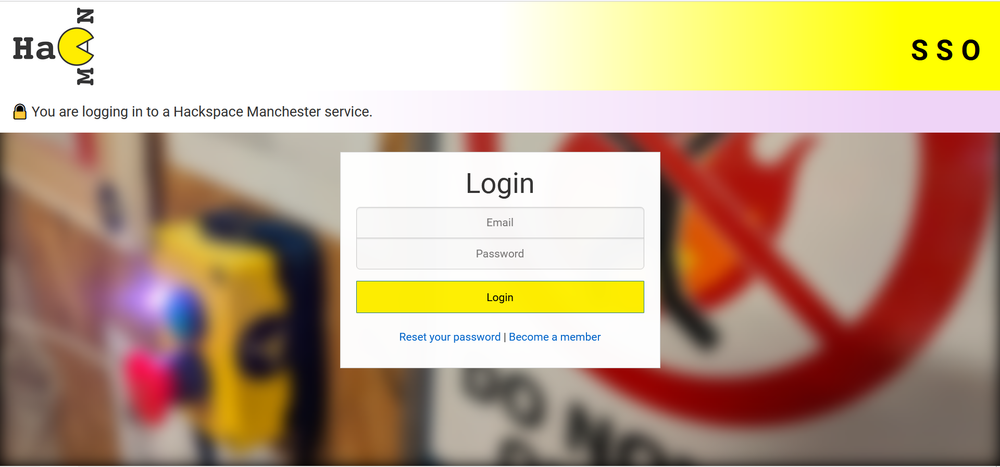

# SSO provider for Hackspace Manchester

## ⚠️ Work In Progress⚠️

We have a forum among other services that all have their own logins, and this makes it hard to get people using all platforms.

This is a SSO service which the systems of the space can hook into, meaning one login will work for everything.

It refers to members.hacman.org.uk for it's log of users. The example in question is getting the list.hacman.org.uk (Discourse) to work.

## Users
Enabling SSO for the forum will mean that external users will need to sign up to members.hacman.org.uk. This:
- Means that all users are under one roof
- Can allow for a £0 (or default inactive) membership which allows online access only, not physical access
- Means we can additionally have a separate signup form that only asks for name and email etc, to simplify the process, as a £0 membership may not be obvious.
- Doesn't change sign ups. A sign up was always required, but by doing it with the member system external users can feel like they belong to the space as they'll have a member account. In the same way as anyone can sign up without setting up a payment.

Users who are already registered with the forum can log in with their members.hacman.org.uk account and it'll automatically map providing they're using the same email
- If they use a different email, it can be easily merged by an admin on the forum
- The external ID to be used will be the member ID. This will map users across platforms.

## Development
This uses Google Cloud Functions.
There are two functons:
- sso
  - This presents a login form and is where the user is directed to when they try to login on the forum.
  - The SSO object (nonce and return URL) is checked against the signature before showing the form.
- sso-auth
  - This does the authentication with members.hacman.org.uk and returns user data if any is found.

### Secrets
You'll need to set an env var `secret` which matches that of Discourse.

## Security
I've done login work before so have a broad familiarity with things like SSO but appreciate any and all comments on the security of this.

All data is signed to make sure there's been no tampering, and Discourse provides a nonce to make sure requests are unique. 

The guide I followed is here: https://meta.discourse.org/t/discourseconnect-official-single-sign-on-for-discourse-sso/13045

The secret in question is stored in Discourse.

## TODO
Many TODOs have been left in source code.
🛑 = blocker
➕ = nice to have

Namely:
- 🛑 Actual authentication from member system. Requires code change there
- 🛑 AJAX form so the USER doesn't see or interact with JSON
  - ➕ Have form work with no JS. 
- 🛑 Updating the URLs, I'd like the Cloud Functions to be behind API Gateway or something then maybe load balancer etc so that we can have it tied to sso.hacman.org.uk
  - This will increase trust as the current Cloud Function URL is nasty
- ➕ Remove discourse-sso package as it just does basic node crypto stuff anyway
